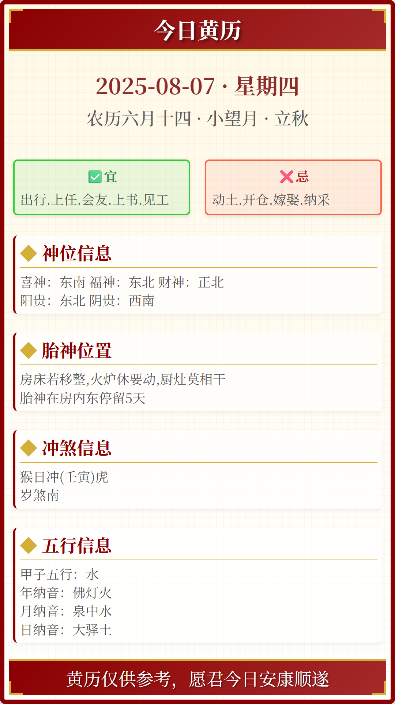

# #️⃣ 每日黄历卡片

一个每日自动生成每日黄历`图片`、`视频`、上传至 OSS、并通过邮件通知的 Node.js 项目。




## ✨ 功能特性

- 📅 每日自动生成 - 上海时间每天 00:30 准时生成当日黄历卡片/视频
- ☁️ 云存储支持 - 自动上传视频到阿里云 OSS
- ✉️ 通知系统 - 邮件通知生成结果（支持成功/失败）
- 🔄 自动化工作流 - GitHub Actions 定时执行并提交结果

---

## 🛠️ 项目结构

```bash
.
├── material/            # 素材
├── output/              # 合成后的图片和视频
├── core/
│   ├── generate.js      # 生成黄历卡片或视频的核心逻辑
│   ├── upload.js        # OSS 上传模块
│   └── notify.js        # 邮件通知模块
├── .env                 # 环境变量配置
├── .envtpl              # 环境变量配置模板
├── index.js             # 主入口脚本
├── index.tpl            # 生成网页的模板
├── index.html           # 生成卡片的网页
```

## 🚀 快速开始

### 方式一：Fork 并自动运行（推荐）

1. 点击右上角 Fork 按钮复制仓库
2. 在仓库 Settings > Secrets and variables > Actions 中添加环境变量(参考下文环境变量)
3. 系统将在每日 00:30（上海时间）自动运行并提交结果

### 方式二：本地开发运行

1. 克隆仓库

```
git clone https://github.com/chinjiaqing/daily-lunar.git
```

2. 进入项目目录

```
cd daily-lunar
```

3. 安装依赖

```
npm install
```

4. 根目录创建.env 配置文件，并粘贴.envtpl 中的配置到.env 文件中

5. 运行项目

```
npm run dev
```

## ⚙️ 环境变量配置（均为选填）

| 变量名             | 描述                 | 示例值                          |
| ------------------ | -------------------- | ------------------------------- |
| `EMAIL_SMTP_USER`  | SMTP 邮箱用户名      | your_email@163.com              |
| `EMAIL_SMTP_TOKEN` | SMTP 邮箱授权令牌    | your_email_token                |
| `EMAIL_SMTP_HOST`  | SMTP 服务器地址      | \*smtp.163.com                  |
| `EMAIL_SMTP_PORT`  | SMTP 服务器端口      | \*465                           |
| `EMAIL_RECEIVER`   | 接收通知的邮箱       | receiver@qq.com                 |
| `OSS_ACCESS_KEY`   | 阿里云 OSS AccessKey | LTAI5t...                       |
| `OSS_SECRET_KEY`   | 阿里云 OSS SecretKey | B2cMpD...                       |
| `OSS_REGION_NAME`  | OSS 存储区域         | oss-cn-shanghai                 |
| `OSS_BUCKET_NAME`  | OSS 存储桶名称       | lunar-calendar                  |
| `OSS_DIR_PATH`     | OSS 存储路径         | \*output                        |
| `CALLBACK_URL`     | 生成完成回调地址     | https://api.example.com/webhook |

### 回调 CALLBACK_URL

将会以 POST 请求发送到`CALLBACK_URL`:

```json
{
    "date":"2025-08-07",
    "oss_url":"http://yourossname.oss-cn-chengdu.aliyuncs.com/output/main.mp4",
    "oss_url":"output/main.mp4"
}
```

---

如果您觉得还不错，请 star 支持，感谢！
